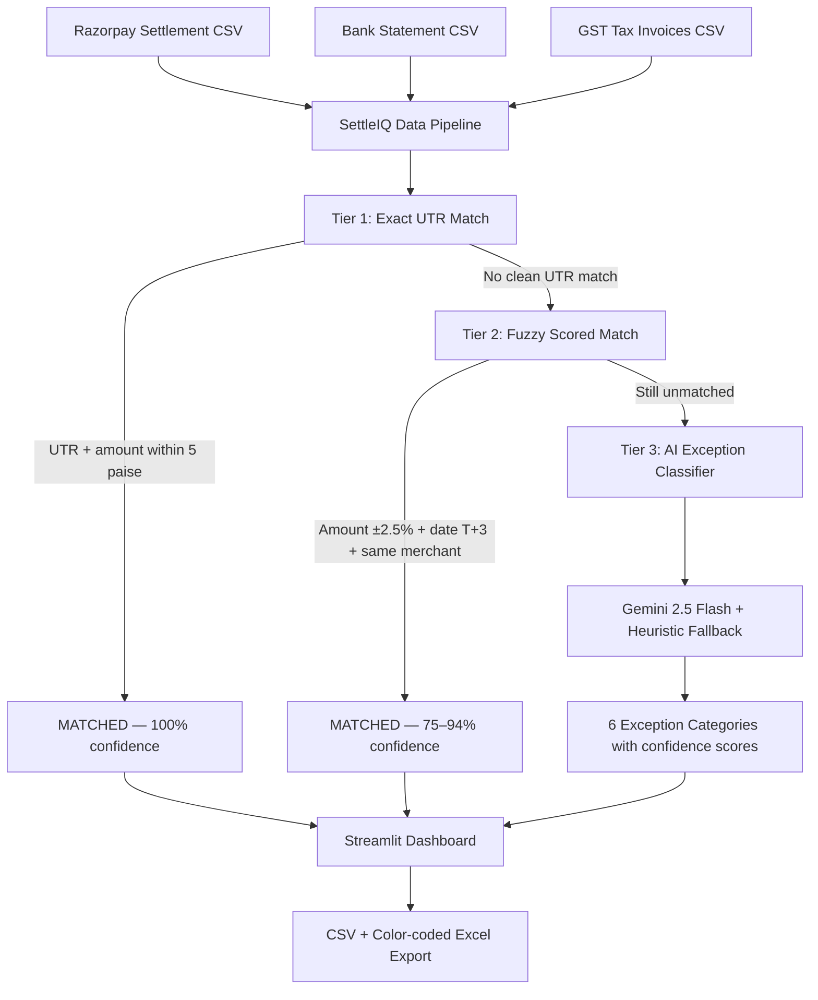

# ⚡ SettleIQ — AI Finance Controller

> **Razorpay AI Buildathon 2026 — Track 04: AI Finance Controller**
> **Live Demo:** https://settleiq.streamlit.app
> **Track Bar:** Throughput + measured accuracy + honest exception list ✅

---

## Results At A Glance

```
500 records processed    →    under 5 seconds
405 Tier 1 exact matches →    deterministic, 100% confidence
 56 Tier 2 fuzzy matches →    scored, 75–94% confidence
 89 exceptions classified →   6 categories, AI-investigated
92.2% auto-match rate    →    461 / 500 RZP records matched
₹1.04 crore cleared      →    confirmed bank credits
₹21.5 lakhs at risk      →    categorized by priority
  6 unit tests           →    all passing (0.002s)
```

---

## The Problem

Indian SMB finance teams spend 3–4 hours every week manually matching Razorpay settlement CSVs against bank statements in Excel. At 500+ transactions a month this breaks down completely:

- Razorpay settles in T+2 to T+3 business days — dates never align cleanly
- Banks credit slightly different amounts due to MDR fee deductions (1.8–2.5%)
- Duplicate UTR entries happen when NPCI retries batch settlements
- GST on MDR fees needs separate reconciliation against GSTR-2B filings
- Excel VLOOKUP breaks at scale

SettleIQ automates this entire workflow end-to-end in under 5 seconds.

---

## What Makes It Different From Razorpay Recon

Razorpay already has a product called Recon — built for enterprise offline POS businesses doing 200M+ transactions a month. It is a paid black box with no GST invoice matching and no audit trail you can read.

SettleIQ is different in 3 specific ways:

| | Razorpay Recon | SettleIQ |
|---|---|---|
| **Matching** | 2-way (RZP ↔ Bank) | 3-way (RZP ↔ Bank ↔ GST invoices) |
| **Transparency** | Black box result | Every match has rule ID + confidence score + timestamp |
| **Interaction** | Dashboard only | Conversational Q&A agent in plain English |
| **GST** | Not native | GSTR-2B variance detection built-in |
| **Scale** | 200M+ enterprise POS | 500–50,000 SMB online transactions |

---

## Architecture & 3-Tier Reconciliation



---

## The 3-Tier Engine

### Tier 1 — Deterministic Exact Match

```python
# Convert to integer paise to eliminate IEEE 754 floating point bugs
rp_paise   = int(round(amount_rp * 100))
bank_paise = int(round(amount_bank * 100))
if abs(rp_paise - bank_paise) <= 5:  # 5 paise tolerance
    → MATCHED at 100% confidence
```

**Why paise?** ₹5,420.00 vs ₹5,419.99 was failing exact match due to floating point representation. Converting to integer paise eliminates this class of bugs entirely. This was a real bug caught in development.

**Result: 405 records matched (81%) in under 1 second.**

### Tier 2 — Scored Fuzzy Match

```
Score = 1.0 - (amount_diff_pct × 5) - (date_gap × 0.03)
Clamped to [0.75, 0.94]

Conditions:
  - Same merchant_id
  - Amount difference ≤ 2.5% (covers MDR fee variance of 1.8–2.5%)
  - Date gap ≤ T+3 (RBI mandate for card/netbanking settlements)
```

**Result: 56 additional records matched at 75–94% confidence.**

### Tier 3 — AI Exception Classification

| Category | Detection | Action |
|---|---|---|
| Ghost Entry / Duplicate | Same UTR 2+ times in bank | Request bank reversal |
| Timing Mismatch | Late credit, >T+3 gap | Wait for next settlement cycle |
| Amount Mismatch | >2.5% difference | Check MDR invoice |
| Missing Entry (Bank) | RZP settled, no bank record | Contact nodal bank with UTR |
| Missing Entry (Razorpay) | Bank credit, no RZP record | Check alternate payment channels |
| GST Variance | GST ≠ taxable × 0.18 | Reconcile GSTR-2B filing |

---

## AI Exception Explainer

```
Provider chain:
1. Type-keyed cache (_EXPLANATION_CACHE)  ← 0 API calls on cache hit
2. Google Gemini 2.5 Flash                ← Primary LLM
3. OpenAI gpt-4o-mini                     ← Secondary LLM
4. Domain heuristic fallback              ← Always works, zero credits needed
```

**Key optimization:** Cache keyed on `exception_type` not `payment_id`. Only 6 exception categories exist — maximum 6 API calls regardless of dataset size. Reduced from 47 API calls to 6. Eliminated rate limit issues entirely.

---

## Dashboard Features

### Tab 1 — Reconciliation Dashboard
- 92.2% auto-match rate gauge
- 3-tier decomposition donut chart (81% / 11.2% / 7.8%)
- Cash Gap Breakdown table — 6 categories with amount at risk and AI confidence
- Settlement Waterfall: Gross → MDR → GST on MDR → Expected → Actual → Gap
- Explain Cash Gap — 4 risk buckets ranked by urgency

### Tab 2 — AI Exception Queue
- Filter by exception category, confidence threshold, payment ID
- Every record expands: AI root cause + confidence score + suggested action
- Mark Resolved button (human-in-loop approval)
- Draft Bank Email button for nodal bank escalation

### Tab 3 — Settlement Q&A Agent
- Plain English queries: "Why is pay_abc123 unreconciled?"
- "How much cash is at risk?" → ₹21.5 lakhs, 89 exceptions
- "What is our current match rate?" → 92.2%, 461 records cleared

### Tab 4 — Audit Trail & Exports
- Full timestamped decision log — every match rule + confidence score
- Download Matched Pairs CSV
- Download Exception Queue CSV
- Download color-coded Excel report (green = matched, red = exception)

---

## Unit Tests

```bash
python -m unittest test_reconciliation.py -v
```

```
test_duplicate_utr_flagged_as_ghost_entry ... ok
test_fuzzy_match_accepts_within_2_5_pct  ... ok
test_fuzzy_match_rejects_beyond_2_5_pct  ... ok
test_missing_bank_entry_classification   ... ok
test_paise_conversion_float_fix          ... ok
test_tier1_exact_utr_match               ... ok

Ran 6 tests in 0.002s — OK
```

---

## Bugs Fixed During Development

| # | Bug | Root Cause | Fix |
|---|---|---|---|
| 1 | ₹5,420.00 ≠ ₹5,419.99 | IEEE 754 floating point | Convert to integer paise before comparison |
| 2 | 47 API calls → rate limited | Cache keyed on payment_id | Re-key on exception_type — max 6 calls |
| 3 | OpenAI insufficient_quota | Credits exhausted at 500-record scale | Reorder chain: Gemini → OpenAI → heuristic |
| 4 | Waterfall showing ₹0 received | Reading bank_df not matched_df | Use matched_df['bank_amount'] |
| 5 | KeyError: 'payment_id' on real CSV | Column normalizer missing space→underscore | Add .str.replace(r'\s+', '_') + alias map |

---

## Exception Categories — Predefined

1. **Amount Mismatch** — Difference >2% between RZP settlement and bank credit
2. **Timing Mismatch** — Settlement date gap >3 days
3. **Missing Entry (Bank)** — Settled in RZP, no bank credit within T+3
4. **Missing Entry (Razorpay)** — Bank credit received, no RZP record
5. **Ghost Entry / Duplicate** — Same UTR credited multiple times in bank
6. **GST Variance** — GST on MDR differs from expected 18% calculation

---

## Quick Start

```bash
# Install dependencies
pip install -r requirements.txt

# Set up environment
cp .env.example .env
# Add GEMINI_API_KEY and OPENAI_API_KEY

# Generate dataset
python generate_datasets.py

# Run reconciliation engine
python reconciliation_engine.py

# Launch dashboard
streamlit run app.py

# Run tests
python -m unittest test_reconciliation.py -v
```

---

## File Structure

| File | Lines | Purpose |
|---|---|---|
| `app.py` | 750 | Streamlit dashboard — 4 tabs, waterfall, Q&A agent, exports |
| `reconciliation_engine.py` | 367 | 3-tier matching engine + Excel export |
| `exception_explainer.py` | 170 | Gemini → OpenAI → heuristic provider chain |
| `generate_datasets.py` | 233 | Razorpay API ingestion + synthetic data generator |
| `test_reconciliation.py` | — | 6 unit tests, all passing |
| `README.md` | — | This file |

---

## On Our Numbers

All metrics are calculated live from the 500-record dataset in this repo — not industry claims. Run `python reconciliation_engine.py` to reproduce them yourself.

```
Tier 1 (Exact UTR):     405 matched   (deterministic, 100% confidence)
Tier 2 (Fuzzy Match):    56 matched   (scored, 75–94% confidence)
Tier 3 (Exceptions):     89 classified (6 categories, AI-investigated)
Match Rate:             92.2%          (461/500 RZP records)
Cleared Position:       ₹10,478,225.64
Amount at Risk:          ₹2,155,357.19
```
