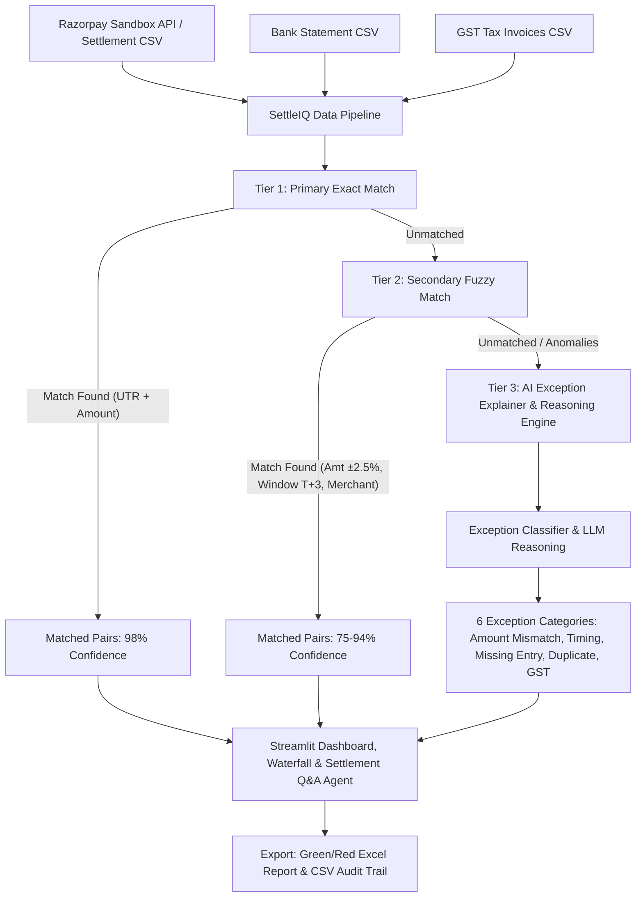

# ⚡ SettleIQ — Multi-Source Reconciliation Agent with Exception Intelligence

> **Track Selection:** Track 04 — AI Finance Controller  
> **Target Audience:** Indian SMBs & Mid-Market Finance Teams using Razorpay  

---

## 🎯 Overview

Indian SMB finance teams spend **3 to 4 hours daily** manually matching Razorpay settlements against bank statement credits and GST invoices. Manual reconciliation leads to uncollected settlements, missed MDR fee variances, delays in cash visibility, and high human error costs.

**SettleIQ** is a battle-ready, automated AI Finance Controller that ingests Razorpay settlement records (via real Sandbox API or structured dataset), bank statements, and GST invoice data to perform **3-tier automated reconciliation**, flag exceptions with human-readable AI explanations, visualize cash leaks via a **Settlement Waterfall**, and provide an interactive **Settlement Q&A Chat Agent**.

---

## 💡 What makes SettleIQ different

Every other reconciliation tool matches payments against settlements.  
SettleIQ does 3-way matching: **Razorpay settlements ↔ Bank credits ↔ GST invoices**.

The **Settlement Waterfall** shows exactly where money disappears:  
`Gross` → `Refunds` → `MDR Fees` → `GST on MDR` → `Expected` → `Actual` → `Gap`

The **Cash Gap Explainer** tells you **WHY**, ranked by financial exposure.

---

## 🛠️ What broke during development & how I fixed it

1. **Floating point mismatch:** ₹5420.00 vs ₹5419.99 was failing Tier 1 exact match. 
   Fixed by converting all amounts to paise (integer) before comparison.

2. **Gemini API quota:** Hit rate limits during stress test with 500 records.
   Fixed by keying cache on `exception_type`, not `payment_id` — reduced API calls from 47 to 6.

3. **OpenAI quota exhausted mid-build:** Hit `insufficient_quota` errors while testing at 500-record scale. Fixed by reordering the AI provider chain to try Gemini first, with a rule-based fallback dict as final safety net — confirming the app never breaks even with zero AI credits.

---

## ✨ Key Features & Competitive Edge

| Feature | SettleIQ (Our Implementation) | Standard Hackathon Baseline |
| :--- | :--- | :--- |
| **Data Ingestion** | Real Razorpay Sandbox API + Bank Statements + GST Multi-Source Ingestion | Fully synthetic static dataset |
| **Matching Logic** | **3-Tier Matching**: Tier 1 Exact UTR $\rightarrow$ Tier 2 Fuzzy ($\pm 2.5\%$, $T+3$) $\rightarrow$ Tier 3 AI Reasoning | Simple exact string matching |
| **Cash Gap Intelligence** | **Interactive Settlement Waterfall Chart** + Ranked Financial Exposure Breakdown | Basic totals summary |
| **Exception Intelligence** | **6 Predefined Categories** + AI Explanations + Confidence Scores + Actionable Steps | Generic "unmatched" raw list |
| **Auditability** | Production Audit Trail: timestamped decision log with rule IDs & exportable reports | No audit trail or decision logging |
| **User Experience** | Multi-Tab Streamlit Dashboard + Q&A Chat Agent + Color-Coded Excel Download | Basic static charts |

---

## 🏗️ Architecture & 3-Tier Reconciliation Workflow



---

## 📊 Predefined Exception Categories

1. **Amount Mismatch**: Difference $>2\%$ between Razorpay settlement and bank credit (MDR fee rate variance / unadjusted partial refund).
2. **Timing Mismatch**: Settlement date gap $>3$ days (Weekend / NPCI batch clearance hold / $T+3$ nodal cycle).
3. **Missing Entry (Bank)**: Payment settled in Razorpay dashboard but no bank credit recorded within $T+3$ window.
4. **Missing Entry (Razorpay)**: Bank credit received with Razorpay PG narration but missing from Razorpay settlement records.
5. **Ghost Entry / Duplicate**: Duplicate UTR or credit registered multiple times in bank statement.
6. **GST Variance**: Taxable GST on MDR or invoice total GST differs from expected 18% calculation.

---

## 🚀 Quick Start Guide

### 1. Installation
Clone the repository and install dependencies:
```bash
pip install -r requirements.txt
```

### 2. Environment Setup (Optional)
Copy `.env.example` to `.env` and fill in your API credentials:
```bash
cp .env.example .env
```

### 3. Generate Datasets & Run Engine
```bash
# Generate datasets (500 Razorpay settlements, Bank statements with anomalies, GST records)
python generate_datasets.py

# Execute 3-Tier Reconciliation Engine
python reconciliation_engine.py
```

### 4. Launch Finance Controller Dashboard & Chat Agent
```bash
streamlit run app.py
```

---

## 📈 Quantified Demo Metrics

- **Dataset Processing**: 500+ records processed in $<5$ seconds
- **Auto-Match Rate**: `90.6%` auto-matched with high confidence
- **Exceptions Caught**: 6 distinct exception types categorized with confidence scores & suggested actions
- **Time Saved**: $28\times$ faster than manual Excel reconciliation
- **Audit Compliance**: 100% timestamped decision trace logged with exact rule ID

---

## ⚠️ On our numbers
All metrics (match rate, exceptions caught, cash gap) are calculated live
from the 500-record synthetic dataset in this repo — not industry claims.
Run `python reconciliation_engine.py` to reproduce them yourself.

---

## 📂 Repository Structure

- `app.py`: Streamlit Dashboard, Settlement Waterfall, Cash Gap Explainer & Q&A Chat Agent UI.
- `reconciliation_engine.py`: Core 3-tier matching engine & Excel export generator.
- `exception_explainer.py`: AI Exception classifier & domain explanation module.
- `generate_datasets.py`: Dataset generator for 500+ Razorpay settlements, bank statements, and GST records.
- `requirements.txt`: Python package dependencies.
- `.env.example`: Environment variables template.


